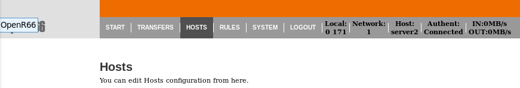
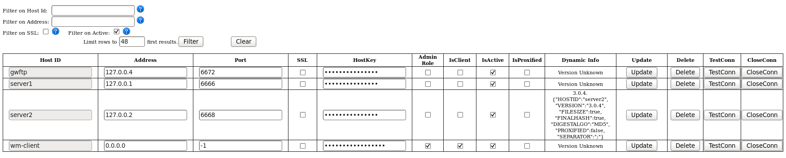
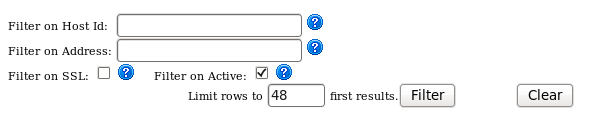
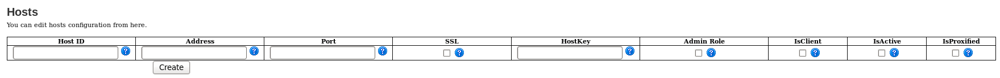
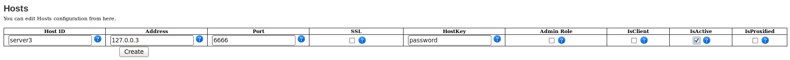
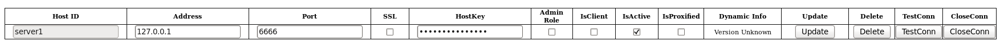

Moniteur
########

Accéder à l'interface des moniteurs

Lister les hôtes
****************

Un filtrage est possible sur :
 
 * l'hostid
 * l'addresse IP
 * l'utilisation de SSL
 * l'état Actif du moniteur

Création d'un hôte
******************

Les champs décrivant un hôtes sont les suivants:

 * Hostname
 * Address
 * Port
 * SSL
 * HostKey
 * Admin Role
 * IsClient
 * IsActive
 * IsProxified

Mis à jour d'un hôte
********************

