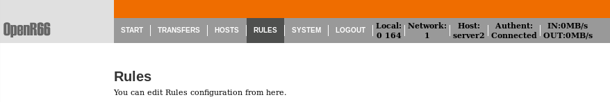
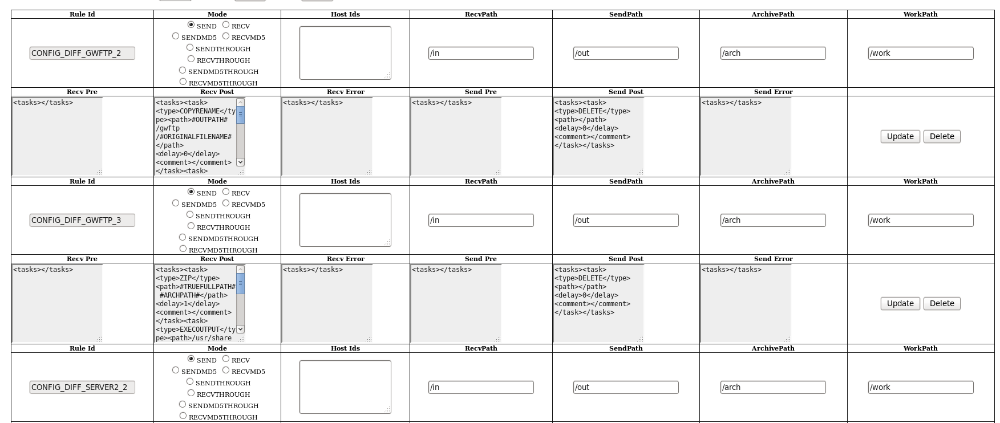
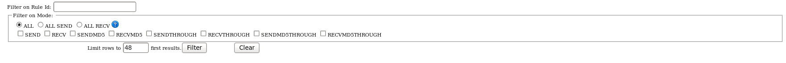
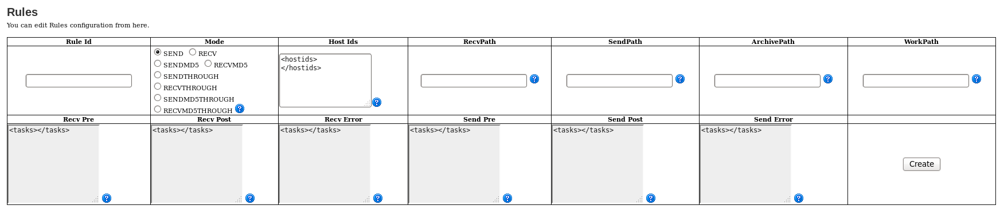
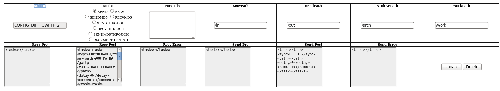

Règle
#####

Accéder à l'interface des règles

Listing des règles
******************

Un filtrage est possible sur :
 
 * le nom de la règle
 * le type de règle

Création de règle
*****************

Depuis l'interface d'adminsitration il est possible de créer de nouvelles règles de transferts

Une règle est composé de son ID, nom de la règle (celui ci doit être unique). 
D'un mode d'envoie 
 
 * SEND transfert d'envoie, le fichier va du client au serveur
 * RECV transfert de reception, le fichier va du serveur au client

Ces 2 commandes peuvent etre completer par les :

 * "" transfert classique
 * MD5 transfert avec verification d'intégrite par packet
 * THROUGH 
 * MD5THROUGH

Ex: SEND, RECVMD5, SENDTHROUGH

Hostids liste la liste des moniteurs authorisés à utiliser la règle.

RecvPath, SendPath, ArchPath, WorkPath sont respectivement les dossiers, de reception, d'envoie, 
d'archive et de travail de la règle.

Les RecvPre, RecvPost et RecvError sont les tâches effectuées par le moniteur recepteur 
respectivement avant le transfert, apres le transfert et si le transfert tombre en erreur.
Même chose pour les SendPre, SendPost, et SendError pour le moniteur emmeteur.

Les tâche éxécutées par les rêgles sont décrites comme suit:

 * Type de tâche
 * Path, utilisé pour spécifier les options de la tâche
 * Delay, temps aloué avant échec 
 * When, condition d'execution

Pour plus de détails référez vous à la liste des tâches.

Mis à jour de règle
*******************

