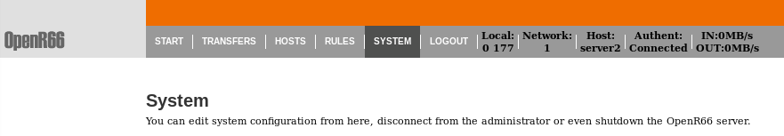
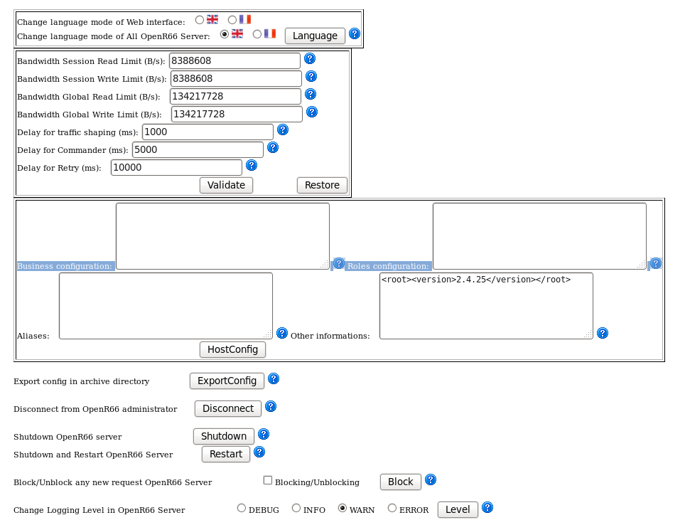

Système
#######

L'écran système vous permet de

 * Changer la langue de l'interface d'administration
 * Editer les limitations d'utilisation de la bande passante 
 * Editer les configurations annexes du moniteur (business, rôle, allias, ...)

