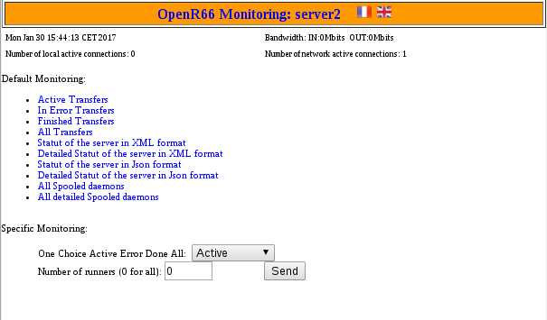
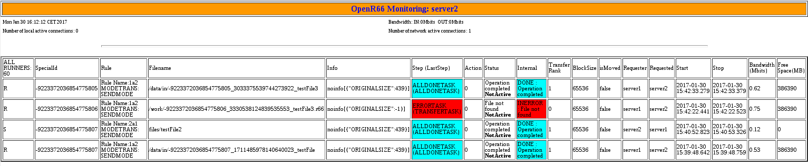

##########
Monitoring
##########

L'interface de monitoring permet de visualiser l'ensemble des transferts passés
et en cours.

Accueil
=======

Transferts passés
=================

Statut serveur
==============

Elle permet aussi d'avoir un accès au statut du server au format `XML` ou `JSON`.

Le statut simple donne accès au informations suivantes :

.. code-block:: xml

  <STATUS>
    <HostID>server2</HostID>
    <Date>2017-01-30T15:53:22.782+01:00</Date>
    <LastRun>2017-01-30T15:53:22.774+01:00</LastRun>
    <FromDate>2017-01-29T15:53:22.774+01:00</FromDate>
    <SecondsRunning>869</SecondsRunning>
    <NetworkConnections>1</NetworkConnections>
    <NbThreads>114</NbThreads>
    <InBandwidth>0</InBandwidth>
    <OutBandwidth>0</OutBandwidth>
    <OVERALL>
      <AllTransfer>4</AllTransfer>
      <Unknown>0</Unknown>
      <NotUpdated>0</NotUpdated>
      <Interrupted>0</Interrupted>
      <ToSubmit>0</ToSubmit>
      <Error>1</Error>
      <Running>0</Running>
      <Done>3</Done>
      <InRunning>0</InRunning>
      <OutRunning>0</OutRunning>
      <LastInRunning>2017-01-30T15:42:33.302+01:00</LastInRunning>
      <LastOutRunning>2017-01-30T15:38:53.121+01:00</LastOutRunning>
      <InAll>3</InAll>
      <OutAll>1</OutAll>
      <InError>1</InError>
      <OutError>0</OutError>
    </OVERALL>
    <STEPS>
      <Notask>0</Notask>
      <Pretask>0</Pretask>
      <Transfer>0</Transfer>
      <Posttask>0</Posttask>
      <AllDone>3</AllDone>
      <Error>1</Error>
    </STEPS>
    <RUNNINGSTEPS>
      <AllRunning>0</AllRunning>
    </RUNNINGSTEPS>
  </STATUS>

Le statut détaillé renvoie en plus le détails des etapes de lancement de transfert 
ainsi que les différentes erreurs de transfert rencontrées.

.. code-block:: xml
   
  <STATUS>
    <HostID>server2</HostID>
    <Date>2017-01-30T15:53:10.845+01:00</Date>
    <LastRun>2017-01-30T15:53:10.834+01:00</LastRun>
    <FromDate>2017-01-29T15:53:10.834+01:00</FromDate>
    <SecondsRunning>857</SecondsRunning>
    <NetworkConnections>1</NetworkConnections>
    <NbThreads>114</NbThreads>
    <InBandwidth>0</InBandwidth>
    <OutBandwidth>0</OutBandwidth>
    <OVERALL>
      <AllTransfer>4</AllTransfer>
      <Unknown>0</Unknown>
      <NotUpdated>0</NotUpdated>
      <Interrupted>0</Interrupted>
      <ToSubmit>0</ToSubmit>
      <Error>1</Error>
      <Running>0</Running>
      <Done>3</Done>
      <InRunning>0</InRunning>
      <OutRunning>0</OutRunning>
      <LastInRunning>2017-01-30T15:42:33.302+01:00</LastInRunning>
      <LastOutRunning>2017-01-30T15:38:53.121+01:00</LastOutRunning>
      <InAll>3</InAll>
      <OutAll>1</OutAll>
      <InError>1</InError>
      <OutError>0</OutError>
    </OVERALL>
    <STEPS>
      <Notask>0</Notask>
      <Pretask>0</Pretask>
      <Transfer>0</Transfer>
      <Posttask>0</Posttask>
      <AllDone>3</AllDone>
      <Error>1</Error>
    </STEPS>
    <RUNNINGSTEPS>
      <AllRunning>0</AllRunning>
      <Running>0</Running>
      <InitOk>0</InitOk>
      <PreProcessingOk>0</PreProcessingOk>
      <TransferOk>0</TransferOk>
      <PostProcessingOk>0</PostProcessingOk>
      <CompleteOk>0</CompleteOk>
    </RUNNINGSTEPS>
    <ERRORTYPES>
      <ConnectionImpossible>0</ConnectionImpossible>
      <ServerOverloaded>0</ServerOverloaded>
      <BadAuthent>0</BadAuthent>
      <ExternalOp>0</ExternalOp>
      <TransferError>0</TransferError>
      <MD5Error>0</MD5Error>
      <Disconnection>0</Disconnection>
      <FinalOp>0</FinalOp>
      <Unimplemented>0</Unimplemented>
      <Internal>0</Internal>
      <Warning>0</Warning>
      <QueryAlreadyFinished>0</QueryAlreadyFinished>
      <QueryStillRunning>0</QueryStillRunning>
      <KnownHost>0</KnownHost>
      <RemotelyUnknown>0</RemotelyUnknown>
      <CommandNotFound>0</CommandNotFound>
      <PassThroughMode>0</PassThroughMode>
      <RemoteShutdown>0</RemoteShutdown>
      <Shutdown>0</Shutdown>
      <RemoteError>0</RemoteError>
      <Stopped>0</Stopped>
      <Canceled>0</Canceled>
      <FileNotFound>1</FileNotFound>
      <Unknown>0</Unknown>
    </ERRORTYPES>
  </STATUS>

